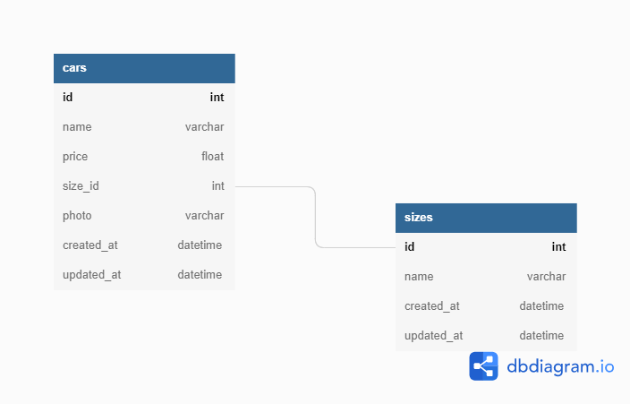

# Car Management Dashboard

Page Cars  
List Cars  
Page Add New Car  
Page Edit

    

## How to run

```
.
mengaktifkan npm 
    └── npm install

install sequelize ..
   └── npx sequelize init
   └── (buka folder config.json)
        ganti username, password, database, dan dialect

membuat database..
   └── npx sequelize db:create
   └── npx sequelize model:generate --name cars  --attributes name:string,price:integer,size:string,photo:text
   └── npx sequelize db:migrate

mengaktifkan server...
   └──npm run start
```

## Endpoints

### Endpoints CRUD
Create : POST "/cars"
Edit: POST "/cars/:id"
Delete: POST "/deleteCars/:id"


### Endpoints ejs
Index: GET "/"    
Create: GET "/cars"  
Edit: GET "/edit/:id"  

## Directory Structure

```
.
├── config
│   └──config.json
├── controllers
│   └── carsController.js
├── migrations
│   └── 20220422034654-create-cars.js
├── models
│   └── cars.js
│   └── index.js
├── public
│   ├── css
│   ├── imges
│   └── js
├── seeders
├── services
│   └── carsService.js
├── views
│   └── create.ejs
│   └── edit.ejs
│   └── index.ejs
├── .gitignore
├── README.md
├── server.js
├── package-lock.json
├── package.json
```

## ERD


